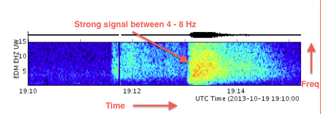
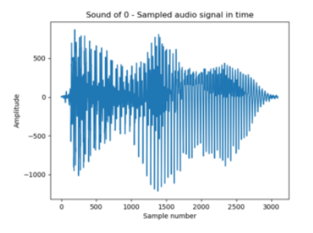

# LearningDeep

This repository contains some small projects that use deep learning for some classification problems. This is mainly meant for me to learn how frameworks like `pytorch` work, and how all techniques around deep learning work.

Feel free to use all code as example code. This repository probably also contains code that's copied from other tutorials. If this is the case I'll make sure to comment the link of the tutorial in the source files.

### TODO
- [x] Make a GAN that handles the XOR problem.
- [ ] Make a neural network that can classify images of hand-written digits as digits.
- [x] Look at how we can input audio into a neural network. 
- [ ] Actually work with an audio dataset.
- [ ] Classifier voor (m/v) op basis van malspectogrammen met vctk dataset.

### Findings


#### Inputting sound

https://medium.com/x8-the-ai-community/audio-classification-using-cnn-coding-example-f9cbd272269e

There are many ways to do this. The basic idea is that the sound needs to be converted to 'images'. A usual way of doing this is by making a `spectogram`.

A spectogram could represent frequency along an axis of time. 

**advantages**
- easy to make, pytorch has built-in audio handling
- easy to see for human eye
- probably really easy to use a sliding first layer on this

**disadvantages**
- I wonder if the information will be useful because it just shows some frequency usage of time, which is really time dependent. Many datasets are probably not made to be converted to such a time-dependent representation.
- Dimensions could change if some sample is longer, making it impossible for some neural network to have a static first layer with some amount of nodes.

Another way of converting audio into tensors could be to `plot samples to amplitude`.

**advantages**
- really easy to do, just use built-in audio library of pytorch
- really small tensor
- it's possible to convert this to some tensor that stores percentages of certain amplitudes. Maybe it'd be helpful to change this amplitude to a db reading to decrease the size of the tensors.

**disadvantages**
- It's not really an image, but rather some graph. Neural networks are basically made for images.
- Depending on how we implement it, the dimensions could vary again, possibly making it impossible to have staticly-sized first layer without implementing the shifting first layer.

Spectrograms seem to be the best solution. They include everything, and are perfect for neural networks.

However, some papers mention *feature extraction*. I wonder if this is neccesary if a neural network could just look at a spectogram.

#### Wikitext-2
This dataset includes all kinds of text, making it possible for a network to learn to generate texts.

#### Pytorch docs

Tensors are basically the same as vectors from numpy, or are the same, but they can also run on the GPU.

A useful property of tensors is the `shape`.

To store the tensor on the GPU:
```py
# We move our tensor to the GPU if available
if torch.cuda.is_available():
  tensor = tensor.to('cuda')
```

Your dataset is a class that needs to implement `__init__`, `__getitem__` and `__len__`.

For example:
```py
class CustomImageDataset(Dataset):
    def __init__(self, annotations_file, img_dir, transform=None, target_transform=None):
        self.img_labels = pd.read_csv(annotations_file)
        self.img_dir = img_dir
        self.transform = transform
        self.target_transform = target_transform

    def __len__(self):
        return len(self.img_labels)

    def __getitem__(self, idx):
        img_path = os.path.join(self.img_dir, self.img_labels.iloc[idx, 0])
        image = read_image(img_path)
        label = self.img_labels.iloc[idx, 1]
        if self.transform:
            image = self.transform(image)
        if self.target_transform:
            label = self.target_transform(label)
        sample = {"image": image, "label": label}
        return sample
```

I'm going to make a GAN for the FashionMNIST dataset!
